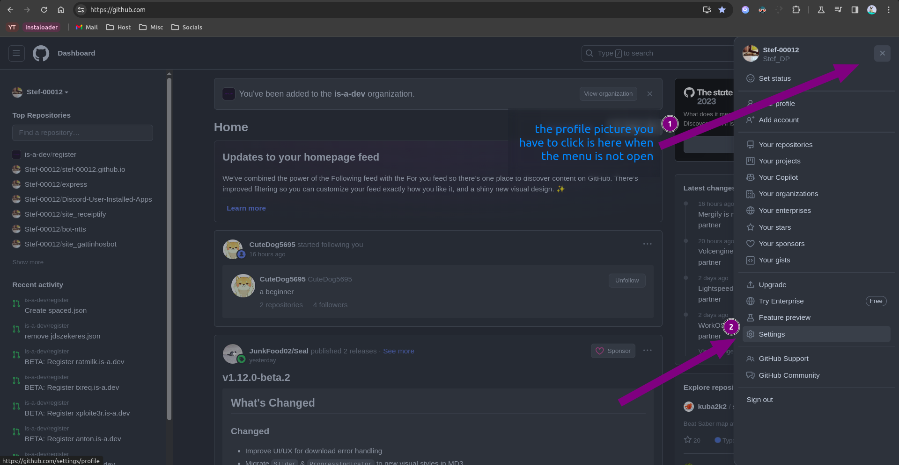

## Configurando GitHub Pages con un subdominio is-a.dev

Esta guía te guiará a través del proceso de configuración de un sitio de GitHub Pages y asignarle tu subdominio is-a.dev.

### Crear un repositorio de GitHub Pages

Primero, necesitarás crear un sitio en GitHub Pages. Sigue las instrucciones en la [Guía de Inicio de GitHub Pages](https://docs.github.com/es/pages/getting-started-with-github-pages).

### Crear el archivo de dominio

Crea un archivo JSON dentro del directorio `domains` (`domains/subdominio.json`) con el siguiente contenido y envía una pull request:

```json
{
    "description": "Describe el uso de este subdominio",
    "repo": "https://github.com/usuario-github/repositorio-github",
    "owner": {
        "username": "usuario-github",
        "email": "yo@ejemplo.com"
    },
    "records": {
        "CNAME": "usuario-github.github.io"
    }
}

```

### Configuración

- Después de que la pull request sea fusionada, podrías ver un error **404** en `subdominio.is-a.dev`o el sitio incorrecto. Para arreglarlo, ve a **Configuración > GitHub pages > Dominio Personalizado** en tu repositorio de GitHub Pages y añade `subdominio.is-a.dev` en el campo proporcionado. Haz esto _sólo **después** de que tu pull request haya sido fusionada._
- Marca la casilla **Forzar HTTPS** debajo del campo de dominio personalizado.
- ¡Espera un momento y tu sitio debería estar en línea!

## Verificando tu dominio is-a.dev con GitHub Pages

### Obtén tu string de verificación

1. Abre GitHub, presiona en tu ícono de perfil en la parte superior derecha y presiona `Configuración`.



2. Presiona `Páginas`.


3. Presiona `Añadir un dominio`.


4. En el campo que aparece, escribe tu nombre de dominio is-a.dev (por ejemplo, `minombre.is-a.dev`) y presiona `Añadir dominio`.


5. Copia el nombre de host y la string de verificación.


### Crear el archivo de dominio

Crea un archivo JSON dentro del directorio `domains/` llamado `domains/nombrehost.json` usando el nombre de host que copiaste en el paso 5 con el siguiente contenido y envía una pull request:

```json
{
    "owner": {
        "username": "usuario-github",
        "email": "yo@ejemplo.com"
    },
    "records": {
        "TXT": "string-de-verificacion-github"
    }
}
```

## Configuración

Después de que tu pull request haya sido fusionada, repite los pasos para obtener la cadena de verificación y presiona el botón `Verificar`.
Si muestra algún error como `No se puede verificar tu dominio`, intenta esperar unos minutos (a veces hasta 24 horas) ya que el DNS podría no haberse actualizado aún.