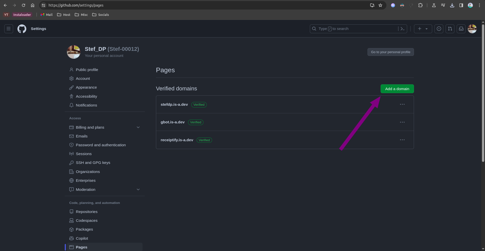
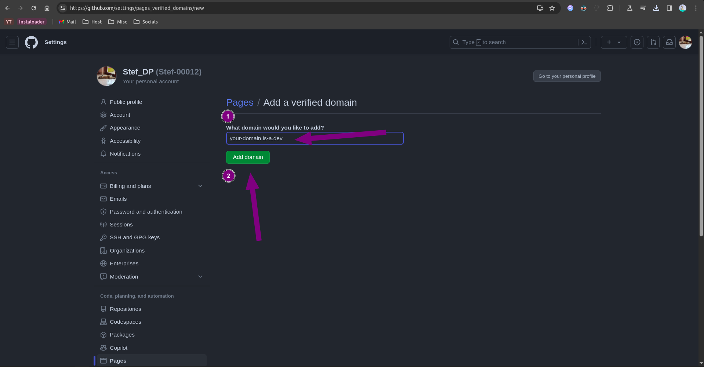
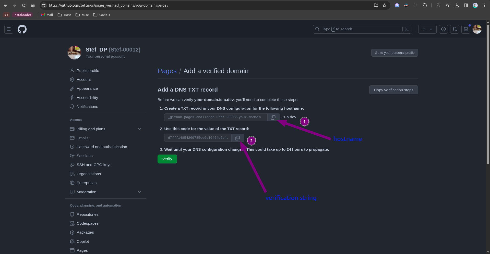

## Utiliser GitHub Pages avec un sous-domaine is-a.dev

Ce guide vous guidera étape par étape pour créer un site sur GitHub Pages et y relier votre sous-domaine is-a.dev.

### Créer un référentiel GitHub Pages

Tout d'abord, vous devez créer un site sur GitHub Pages. Suivez les instructions du guide ["Bien démarrer avec GitHub Pages"](https://docs.github.com/fr/pages/getting-started-with-github-pages).

### Créer le fichier du domaine

Créez un fichier JSON dans le dossier `domains` (`domains/subdomain.json`) avec le contenu suivant et créez une pull request:

```json
{
    "description": "Décrivez l'utilité de ce sous-domaine",
    "repo": "https://github.com/nom-d'utilisateur-github/référentiel-github",
    "owner": {
        "username": "nom-d'utilisateur-github",
        "email": "votre-email@example.fr"
    },
    "record": {
        "CNAME": "nom-d'utilisateur-github.github.io"
    }
}
```

### Configuration

- Après que la pull request soit fusionnée, vous pouvez apercevoir une erreur **404** sur `sous-domaine.is-a.dev` ou le mauvais site. Pour réparer ceci, allez dans votre référentiel GitHub Pages **Settings > GitHub pages > Custom Domain** et ajoutez `sous-domaine.is-a.dev` dans l'emplacement donné. _Faites ceci uniquement **après** que votre pull request soit fusionnée._
- Cochez la case **Enforce HTTPS** en dessous de l'entrée "Custom Domain".
- Attendez quelque temps et votre site sera en ligne !

## Vérifiez votre domaine is-a.dev avec GitHub Pages

### Récupérez le texte de vérification

1. Ouvrez GitHub, cliquez sur votre icône de profile en haut à droite, et cliquez sur `Settings`.


2. Cliquez sur `Pages`.


3. Cliquez sur `Add a domain`.



4. Dans le champ qui apparaît, écrivez le nom de votre domaine is-a.dev (e.g. `myname.is-a.dev`) et cliquez sur `Add domain`.



5. Copiez le nom d'hôte et le texte de vérification.



### Créer le fichier du domaine

Créer un fichier JSON dans le dossier `domains/` appellé `domains/nom-d'hôte.json` en utilisant le nom d'hôte que vous aurez copié dans l'étape 5 avec le contenu suivant et soumettez ensuite une pull request:

```json
{
    "owner": {
        "username": "nom-d'utilisateur-github",
        "email": "votre-email@example.fr"
    },
    "record": {
        "TXT": "texte-de-vérification-github"
    }
}
```

### Configuration

Après que votre pull request aura été fusionnée, répétez les étapes pour obtenir le texte de vérification et pressez le bouton `Verify`.
Si une erreur similaire à `Unable to verify your domain` s'affiche, essayez d'attendre quelque minutes (des fois jusqu'à 24 heures) que le DNS se mette à jour.
